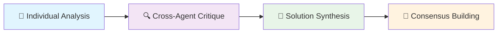
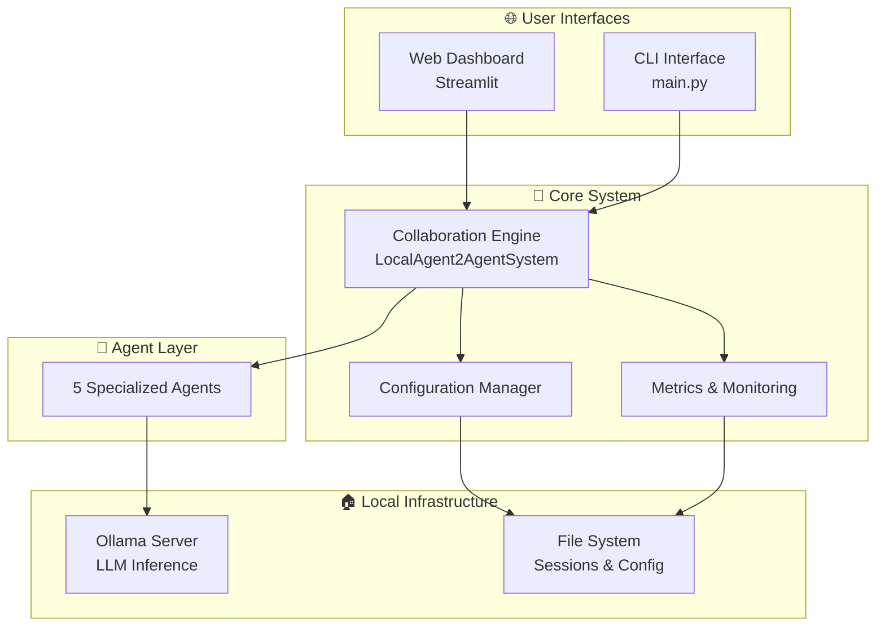

# 🤖 Local Multi-Agent Collaborative Intelligence System

[](https://python.org)
[](https://streamlit.io)
[](https://ollama.com)
[](LICENSE)

> **A production-ready framework that orchestrates multiple AI agents to collaboratively solve complex problems through a structured 4-phase workflow - completely local, private, and cost-effective.**

## 🌟 Key Features

### 🧠 **Multi-Agent Intelligence**

- **5 Specialized AI Agents** with distinct roles and personalities
- **Concurrent Processing** for optimal performance
- **Structured 4-Phase Collaboration** workflow
- **Consensus Building** with confidence weighting

### 🏠 **Local-First Architecture**

- **100% Local Operation** - No cloud dependencies
- **Complete Data Privacy** - Your data never leaves your machine
- **Cost Effective** - No API fees or usage limits
- **Enterprise Ready** - Production-grade reliability and monitoring

### 🎨 **Dual Interface**

- **Modern Web Application** - Streamlit-based dashboard with real-time monitoring
- **Powerful CLI** - Command-line interface for automation and scripting
- **Interactive Mode** - Conversational problem-solving interface

### 🔧 **Production Features**

- **Robust Error Handling** with multiple fallback strategies
- **Comprehensive Metrics** and performance monitoring
- **Session Persistence** with complete history tracking
- **Configuration Management** with presets and customization
- **Async Processing** for maximum throughput

---

## 🚀 Quick Start

### 📋 Prerequisites

1. **Install Ollama** from [ollama.com](https://ollama.com)
2. **Download Required Models**:

   ```bash
   ollama pull llama3.2:3b
   ollama pull deepseek-r1:latest
   ollama serve
   ```

3. **Verify Installation**:

   ```bash
   curl http://localhost:11434/api/tags
   ```

### ⚡ Installation

```bash
# Clone the repository
git clone https://github.com/JacobKayembekazadi/adk-experiment-22.git
cd adk-experiment-22/local_agent_system

# Install dependencies
pip install -r requirements.txt

# Test system connectivity
python main.py --test

# Launch web interface
python run_streamlit.py
```

### 🎯 First Problem

**Web Interface** (Recommended):

1. Open <http://localhost:8501> in your browser
2. Enter your problem in the collaboration interface
3. Watch real-time collaboration unfold!

**Command Line**:

```bash
python main.py --problem "How can we improve customer retention for a SaaS product?"
```

---

## 🏗️ System Architecture

### 🤖 The Agent Team

| Agent | Role | Model | Temperature | Specialty |
|-------|------|-------|-------------|-----------|
| **DataScientist_Alpha** | Data Scientist | llama3.2:3b | 0.3 | Analytical & methodical analysis |
| **ProductManager_Beta** | Product Manager | llama3.2:3b | 0.5 | User-focused & strategic thinking |
| **TechArchitect_Gamma** | Technical Architect | deepseek-r1:latest | 0.4 | System design & implementation |
| **CreativeInnovator_Delta** | Creative Innovator | llama3.2:3b | 0.8 | Bold & unconventional ideas |
| **RiskAnalyst_Epsilon** | Risk Analyst | llama3.2:3b | 0.2 | Cautious & thorough evaluation |

### 🔄 4-Phase Collaboration Workflow



1. **📝 Individual Analysis** - All agents analyze the problem concurrently
2. **🔍 Cross-Agent Critique** - Round-robin critique and feedback
3. **🔬 Solution Synthesis** - Synthesis of insights from all perspectives
4. **🎯 Consensus Building** - Algorithmic consensus with confidence scoring

### 🏛️ Technical Architecture



---

## 💻 Usage Guide

### 🌐 Web Interface (Recommended)

The Streamlit web application provides the most intuitive experience:

```bash
# Start the web application
python run_streamlit.py

# Open browser to http://localhost:8501
```

**Features:**
- 📊 **Real-time Dashboard** - Watch collaboration progress live
- 📈 **Performance Metrics** - Visualize timing and success rates
- 📋 **Session History** - Browse and export past collaborations
- ⚙️ **Configuration Panel** - Adjust agent settings and parameters
- 📱 **Mobile Responsive** - Works on all device sizes

### 💻 Command Line Interface

Perfect for automation, scripting, and power users:

#### Basic Commands

```bash
# Test system health
python main.py --test

# Solve a specific problem
python main.py --problem "Your problem statement here"

# Interactive mode for multiple problems
python main.py --interactive

# Run example scenarios
python main.py --examples

# Verbose output for debugging
python main.py --problem "Your problem" --verbose
```

#### Advanced Options

```bash
# Use configuration presets
python main.py --preset light --problem "Your problem"
python main.py --preset balanced --problem "Your problem"
python main.py --preset premium --problem "Your problem"

# Custom configuration file
python main.py --config custom_config.yaml --problem "Your problem"

# System information
python main.py --list-presets
python main.py --config-info
```

### 🎯 Example Session

```bash
$ python main.py --problem "How should a startup approach scaling from 10 to 100 employees?"

🔄 Running 4-phase collaboration...
✅ Phase 1: Individual Analysis completed (12.3s)
✅ Phase 2: Cross-Agent Critique completed (18.7s)  
✅ Phase 3: Solution Synthesis completed (14.2s)
✅ Phase 4: Consensus Building completed (0.8s)

🎯 FINAL CONSENSUS (Confidence: 0.87):
Based on comprehensive multi-agent analysis, scaling from 10 to 100 employees 
requires a systematic approach across three critical dimensions:

1. **Organizational Structure**: Implement clear hierarchies and departments
2. **Process Systematization**: Establish scalable workflows and documentation  
3. **Culture Preservation**: Maintain startup agility while adding structure

💡 Key Insights:
• Hire middle management before reaching 30 employees
• Implement HR systems and processes early
• Create clear communication channels and decision-making frameworks
• Establish performance management and career development paths

➡️ Next Action: Develop a 6-month scaling roadmap with specific milestones

👥 Contributing Agents: All 5 agents provided insights
📊 Session saved as: session_20250807_143022_abc123.json
```

---

## ⚙️ Configuration

### 🎛️ Configuration Presets

The system includes three built-in presets:

| Preset | Performance | Resource Usage | Best For |
|--------|-------------|----------------|----------|
| **Light** | Fast | Low | Quick testing, limited resources |
| **Balanced** | Good | Medium | Most use cases, default option |
| **Premium** | Best | High | Complex problems, maximum quality |

### 📝 Custom Configuration

Create your own `config.yaml`:

```yaml
system:
  ollama_base_url: "http://localhost:11434"
  ollama_timeout: 120
  max_retries: 3
  log_level: "INFO"
  session_save_dir: "./sessions"
  enable_metrics: true

agents:
  - agent_id: "DataScientist_Alpha"
    role: "Data Scientist"
    model_name: "llama3.2:3b"
    temperature: 0.3
    enabled: true
    personality: "analytical/methodical"
    system_prompt: "Your custom prompt here..."
```

### 🔧 Agent Customization

Each agent can be customized:
- **Model Assignment**: Choose different Ollama models
- **Temperature Settings**: Control creativity vs. consistency
- **System Prompts**: Define agent behavior and expertise
- **Enable/Disable**: Control which agents participate

---

## 📊 Output & Results

### 📈 Real-time Monitoring

The web interface provides:
- **Live Progress Tracking** - See which agents are working
- **Performance Metrics** - Response times and success rates
- **Confidence Visualization** - Chart consensus building
- **Agent Activity** - Individual agent contributions

### 📄 Session Data

Each collaboration generates:

**Structured Results**:
```json
{
  "session_id": "20250807_143022_abc123",
  "problem_statement": "Your problem...",
  "final_consensus": {
    "main_response": "Comprehensive solution...",
    "confidence_level": 0.87,
    "key_insights": ["insight1", "insight2"],
    "next_action": "Recommended next step",
    "contributing_agents": ["all"]
  },
  "metrics": {
    "total_duration": 45.8,
    "phase_durations": {...},
    "success_rate": 1.0
  }
}
```

**Export Options**:
- 📋 **JSON**: Complete session data
- 📊 **CSV**: Metrics and performance data
- 📝 **Markdown**: Human-readable summary
- 📈 **Charts**: Performance visualizations

---

## 🏗️ Project Structure

```text
local_agent_system/
├── 🌐 Frontend
│   ├── streamlit_app.py          # Web application
│   ├── run_streamlit.py          # Startup script
│   └── .streamlit/config.toml    # Web config
├── 🧠 Core System
│   ├── collaboration/
│   │   └── system.py             # Main orchestrator
│   ├── agents/
│   │   ├── base_agent.py         # Abstract base
│   │   └── local_agent.py        # Ollama integration
│   └── config/
│       ├── config_manager.py     # Configuration system
│       ├── agent_config.yaml     # Agent definitions
│       └── presets/              # Configuration presets
├── 🛠️ Utilities
│   └── utils/
│       ├── ollama_client.py      # Async Ollama client
│       ├── response_parser.py    # JSON parsing
│       └── streamlit_helpers.py  # Web utilities
├── 🗂️ Data
│   └── sessions/                 # Session history
├── 🧪 Testing
│   └── tests/                    # Test suite
└── 📚 Documentation
    ├── README.md                 # This file
    ├── architectural_document.md # Technical architecture
    └── STREAMLIT_README.md       # Web interface guide
```

---

## 🔧 Advanced Topics

### 🚀 Performance Optimization

**Typical Performance**:
- **Phase 1**: 10-30 seconds (concurrent)
- **Phase 2**: 15-45 seconds (sequential)  
- **Phase 3**: 10-30 seconds (concurrent)
- **Phase 4**: <1 second (algorithmic)
- **Total**: 35-106 seconds

**Optimization Tips**:
- Use `light` preset for faster results
- Reduce agent count for simpler problems
- Increase timeout for complex problems
- Monitor memory usage with large models

### 🔌 Extending the System

**Add New Agents**:
1. Define agent in `agent_config.yaml`
2. Specify model, temperature, and prompts
3. System automatically loads new agents

**Custom Models**:
1. Download model: `ollama pull your-model`
2. Update agent configuration
3. Test with `python main.py --test`

**Integration APIs**:
- The system can be imported as a Python module
- REST API wrapper available (future enhancement)
- Session data can be consumed by external systems

### 🔒 Security & Privacy

**Local-First Security**:
- ✅ No external API calls
- ✅ Complete data sovereignty  
- ✅ No internet dependency
- ✅ Standard OS file permissions

**Data Protection**:
- All processing happens locally
- Session data stored in local files
- No telemetry or usage tracking
- User controls all data retention

---

## 🛠️ Troubleshooting

### Common Issues

#### 🔌 Connection Problems

**"Failed to connect to Ollama"**:
```bash
# Check if Ollama is running
curl http://localhost:11434/api/tags

# Start Ollama if needed
ollama serve

# Test connectivity
python main.py --test
```

#### 🤖 Model Issues

**"Model not found"**:
```bash
# List available models
ollama list

# Download missing models
ollama pull llama3.2:3b
ollama pull deepseek-r1:latest

# Update configuration if needed
python main.py --config-info
```

#### 🌐 Web Interface Issues

**"Streamlit not starting"**:
```bash
# Install dependencies
pip install -r requirements.txt

# Start with checks
python run_streamlit.py

# Direct start (debugging)
streamlit run streamlit_app.py
```

#### 🐛 Debug Mode

```bash
# Enable detailed logging
python main.py --problem "test" --verbose

# Check system status
python main.py --config-info

# Test individual components
python -c "from collaboration.system import LocalAgent2AgentSystem; print('Import OK')"
```

### Performance Issues

**Slow responses**:
- Use lighter models (`llama3.2:3b` vs larger models)
- Reduce temperature settings
- Use `light` preset configuration
- Check system resources (CPU, memory)

**Memory issues**:
- Close other applications
- Use smaller models
- Reduce concurrent agent count
- Monitor with `python main.py --config-info`

---

## 🎯 Use Cases

### 💼 Business Applications
- **Strategic Planning** - Multi-perspective business strategy
- **Product Development** - User-centered design decisions  
- **Risk Assessment** - Comprehensive risk analysis
- **Process Improvement** - Workflow optimization
- **Market Analysis** - Multi-faceted market research

### 🔬 Research & Development
- **Literature Review** - Multi-angle research synthesis
- **Problem Analysis** - Complex problem decomposition
- **Solution Design** - Innovative approach generation
- **Validation** - Multi-perspective evaluation
- **Documentation** - Comprehensive report generation

### 🎓 Education & Training
- **Case Study Analysis** - Multi-perspective case examination
- **Curriculum Development** - Educational content creation
- **Assessment Design** - Comprehensive evaluation methods
- **Learning Path Planning** - Personalized education strategies

### 🏗️ Technical Projects
- **Architecture Review** - System design evaluation
- **Technology Selection** - Multi-criteria decision making
- **Code Review** - Comprehensive code analysis
- **Documentation** - Technical writing assistance
- **Troubleshooting** - Complex problem diagnosis

---

## 🤝 Contributing

We welcome contributions! Here's how you can help:

### 🐛 Bug Reports
- Use the GitHub Issues tracker
- Include system information and logs
- Provide steps to reproduce

### 💡 Feature Requests  
- Describe the use case and benefit
- Consider backwards compatibility
- Provide implementation suggestions

### 🔧 Code Contributions
1. Fork the repository
2. Create a feature branch
3. Add tests for new functionality
4. Submit a pull request

### 📚 Documentation
- Improve existing documentation
- Add examples and tutorials
- Translate to other languages

---

## 📜 License

This project is licensed under the MIT License - see the [LICENSE](LICENSE) file for details.

---

## 🙏 Acknowledgments

- **Ollama Team** - For the excellent local LLM infrastructure
- **Streamlit** - For the amazing web framework
- **Python Community** - For the robust ecosystem
- **AI Research Community** - For advancing multi-agent collaboration

---

## 📞 Support & Community

- 📧 **Issues**: [GitHub Issues](https://github.com/JacobKayembekazadi/adk-experiment-22/issues)
- 📖 **Documentation**: [Project Wiki](https://github.com/JacobKayembekazadi/adk-experiment-22/wiki)
- 💬 **Discussions**: [GitHub Discussions](https://github.com/JacobKayembekazadi/adk-experiment-22/discussions)

---

<div align="center">

**🚀 Ready to experience the future of collaborative AI?**

[⬇️ Get Started](#-quick-start) | [📖 View Architecture](architectural_document.md) | [🌐 Try Web Demo](http://localhost:8501)

---

*Built with ❤️ for the local-first AI community*

</div>
