# Local Multi-Agent Collaborative Intelligence System
## Architectural Documentation

### Document Information
- **Project**: Local Multi-Agent Collaborative Intelligence System (adk-experiment-22)
- **Version**: 1.0.0
- **Last Updated**: August 7, 2025
- **Repository**: https://github.com/JacobKayembekazadi/adk-experiment-22

---

## Table of Contents

1. [High-Level Overview](#high-level-overview)
2. [System Architecture](#system-architecture)
3. [Component Architecture](#component-architecture)
4. [Data Models](#data-models)
5. [Core Workflows](#core-workflows)
6. [Technology Stack](#technology-stack)
7. [Integration Points](#integration-points)
8. [Security & Performance](#security--performance)
9. [Deployment Architecture](#deployment-architecture)

---

## High-Level Overview

### Purpose
The Local Multi-Agent Collaborative Intelligence System is a production-ready framework that orchestrates multiple AI agents to collaboratively solve complex problems through a structured 4-phase workflow. The system operates entirely locally using Ollama for LLM inference, eliminating cloud dependencies while maintaining enterprise-grade reliability.

### Key Capabilities
- **Multi-Agent Collaboration**: 5 specialized AI agents with distinct roles and personalities
- **4-Phase Workflow**: Structured collaboration through Individual Analysis, Cross-Agent Critique, Solution Synthesis, and Consensus Building
- **Local-First Architecture**: Complete local operation using Ollama for LLM inference
- **Dual Interface**: Command-line interface and modern web application
- **Production Ready**: Comprehensive error handling, metrics, and session persistence

### Business Value
- **Enhanced Problem Solving**: Leverages diverse AI perspectives for comprehensive analysis
- **Cost Effective**: No cloud API costs, runs entirely on local infrastructure
- **Data Privacy**: Complete data sovereignty with no external dependencies
- **Scalable**: Configurable agent models and processing parameters

---

## System Architecture

### Architecture Overview

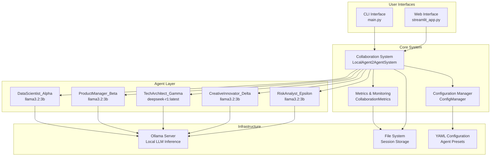
```mermaid
graph TB
    subgraph "User Interfaces"
        CLI[CLI Interface<br/>main.py]
        WEB[Web Interface<br/>streamlit_app.py]
    end
    
    subgraph "Core System"
        COLLAB[Collaboration System<br/>LocalAgent2AgentSystem]
        CONFIG[Configuration Manager<br/>ConfigManager]
        METRICS[Metrics & Monitoring<br/>CollaborationMetrics]
    end
    
    subgraph "Agent Layer"
        AGENT1[DataScientist_Alpha<br/>llama3.2:3b]
        AGENT2[ProductManager_Beta<br/>llama3.2:3b]
        AGENT3[TechArchitect_Gamma<br/>deepseek-r1:latest]
        AGENT4[CreativeInnovator_Delta<br/>llama3.2:3b]
        AGENT5[RiskAnalyst_Epsilon<br/>llama3.2:3b]
    end
    
    subgraph "Infrastructure"
        OLLAMA[Ollama Server<br/>Local LLM Inference]
        STORAGE[File System<br/>Session Storage]
        CONFIG_FILES[YAML Configuration<br/>Agent Presets]
    end
    
    CLI --> COLLAB
    WEB --> COLLAB
    COLLAB --> CONFIG
    COLLAB --> METRICS
    COLLAB --> AGENT1
    COLLAB --> AGENT2
    COLLAB --> AGENT3
    COLLAB --> AGENT4
    COLLAB --> AGENT5
    
    AGENT1 --> OLLAMA
    AGENT2 --> OLLAMA
    AGENT3 --> OLLAMA
    AGENT4 --> OLLAMA
    AGENT5 --> OLLAMA
    
    CONFIG --> CONFIG_FILES
    METRICS --> STORAGE
    COLLAB --> STORAGE
```

### Architectural Patterns

#### 1. **Orchestrator Pattern**
- `LocalAgent2AgentSystem` acts as the central orchestrator
- Manages agent lifecycle, coordination, and workflow execution
- Implements async concurrent processing for optimal performance

#### 2. **Strategy Pattern**
- Multiple configuration presets (light, balanced, premium)
- Pluggable agent configurations with different models and parameters
- Fallback response parsing strategies

#### 3. **Observer Pattern**
- Metrics collection throughout the collaboration lifecycle
- Real-time progress monitoring in the web interface
- Event-driven session persistence

#### 4. **Factory Pattern**
- Agent creation based on configuration specifications
- Dynamic model assignment and initialization
- Configuration-driven component instantiation

---

## Component Architecture

### Frontend Components

#### Command Line Interface (CLI)
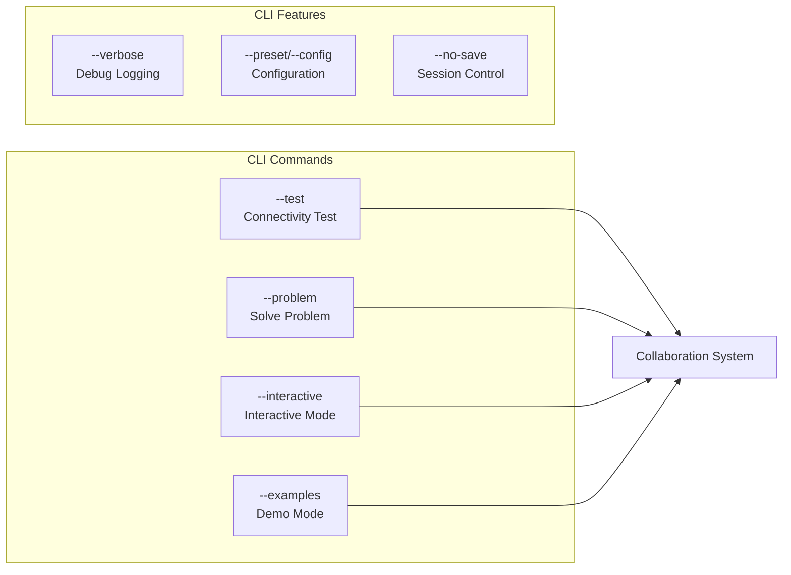
```mermaid
graph LR
    subgraph "CLI Commands"
        TEST[--test<br/>Connectivity Test]
        SOLVE[--problem<br/>Solve Problem]
        INTER[--interactive<br/>Interactive Mode]
        EXAMPLE[--examples<br/>Demo Mode]
    end
    
    subgraph "CLI Features"
        VERBOSE[--verbose<br/>Debug Logging]
        CONFIG[--preset/--config<br/>Configuration]
        SAVE[--no-save<br/>Session Control]
    end
    
    TEST --> COLLAB_SYS[Collaboration System]
    SOLVE --> COLLAB_SYS
    INTER --> COLLAB_SYS
    EXAMPLE --> COLLAB_SYS
```

**Key Files:**
- `main.py`: Entry point with argument parsing and command orchestration
- `demo.py`: Demonstration scenarios and example problems

#### Web Interface (Streamlit)
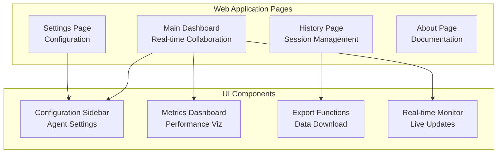
```mermaid
graph TB
    subgraph "Web Application Pages"
        MAIN[Main Dashboard<br/>Real-time Collaboration]
        HISTORY[History Page<br/>Session Management]
        SETTINGS[Settings Page<br/>Configuration]
        ABOUT[About Page<br/>Documentation]
    end
    
    subgraph "UI Components"
        SIDEBAR[Configuration Sidebar<br/>Agent Settings]
        METRICS[Metrics Dashboard<br/>Performance Viz]
        EXPORT[Export Functions<br/>Data Download]
        MONITOR[Real-time Monitor<br/>Live Updates]
    end
    
    MAIN --> SIDEBAR
    MAIN --> METRICS
    MAIN --> MONITOR
    HISTORY --> EXPORT
    SETTINGS --> SIDEBAR
```

**Key Files:**
- `streamlit_app.py`: Main web application with all pages and components
- `run_streamlit.py`: Production startup script with system checks
- `utils/streamlit_helpers.py`: UI helper functions and async integration
- `.streamlit/config.toml`: Streamlit configuration

### Backend Components

#### Core Collaboration System
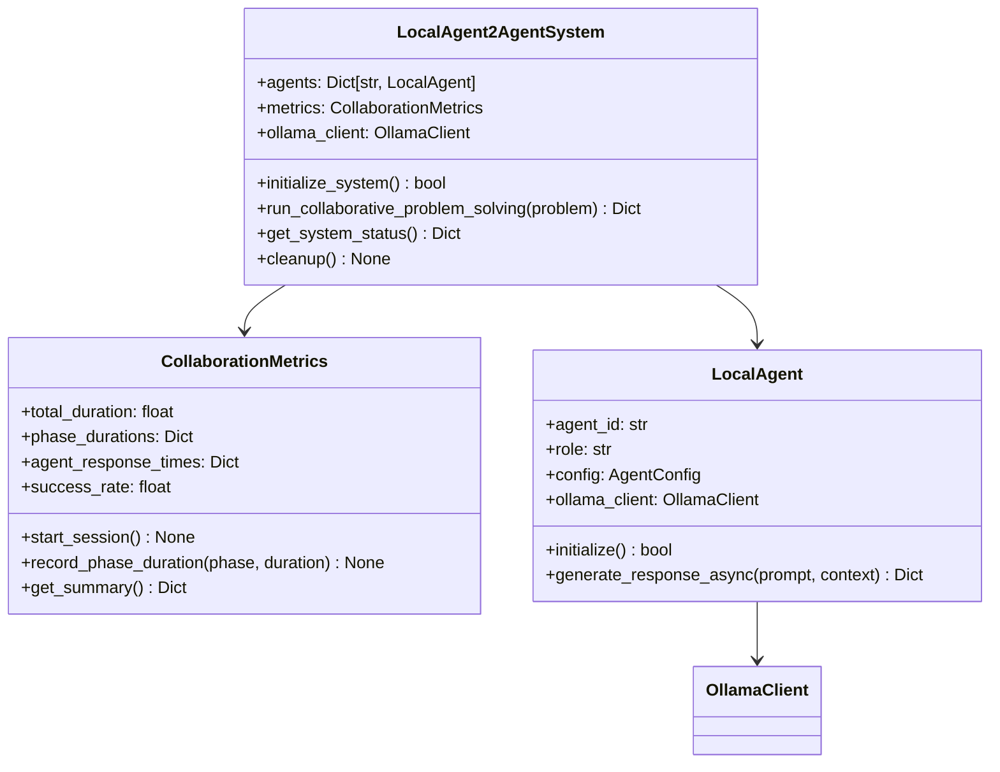
```mermaid
classDiagram
    class LocalAgent2AgentSystem {
        +agents: Dict[str, LocalAgent]
        +metrics: CollaborationMetrics
        +ollama_client: OllamaClient
        +initialize_system() bool
        +run_collaborative_problem_solving(problem) Dict
        +get_system_status() Dict
        +cleanup() None
    }
    
    class CollaborationMetrics {
        +total_duration: float
        +phase_durations: Dict
        +agent_response_times: Dict
        +success_rate: float
        +start_session() None
        +record_phase_duration(phase, duration) None
        +get_summary() Dict
    }
    
    class LocalAgent {
        +agent_id: str
        +role: str
        +config: AgentConfig
        +ollama_client: OllamaClient
        +initialize() bool
        +generate_response_async(prompt, context) Dict
    }
    
    LocalAgent2AgentSystem --> CollaborationMetrics
    LocalAgent2AgentSystem --> LocalAgent
    LocalAgent --> OllamaClient
```

**Key Files:**
- `collaboration/system.py`: Central orchestration system
- `agents/local_agent.py`: Individual agent implementation
- `agents/base_agent.py`: Abstract base agent class

#### Configuration Management
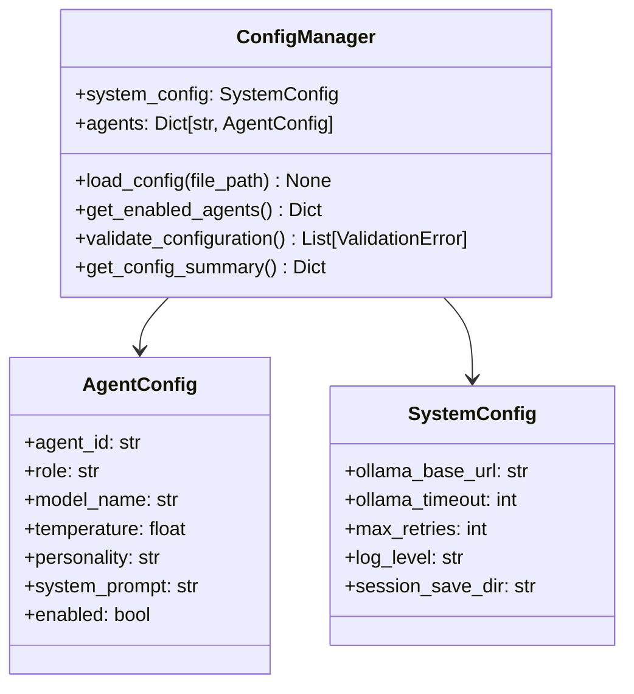
```mermaid
classDiagram
    class ConfigManager {
        +system_config: SystemConfig
        +agents: Dict[str, AgentConfig]
        +load_config(file_path) None
        +get_enabled_agents() Dict
        +validate_configuration() List[ValidationError]
        +get_config_summary() Dict
    }
    
    class AgentConfig {
        +agent_id: str
        +role: str
        +model_name: str
        +temperature: float
        +personality: str
        +system_prompt: str
        +enabled: bool
    }
    
    class SystemConfig {
        +ollama_base_url: str
        +ollama_timeout: int
        +max_retries: int
        +log_level: str
        +session_save_dir: str
    }
    
    ConfigManager --> AgentConfig
    ConfigManager --> SystemConfig
```

**Key Files:**
- `config/config_manager.py`: Configuration loading and validation
- `config/config_schema.py`: Data structures and validation schemas
- `config/settings.py`: Legacy compatibility layer

#### Utility Components
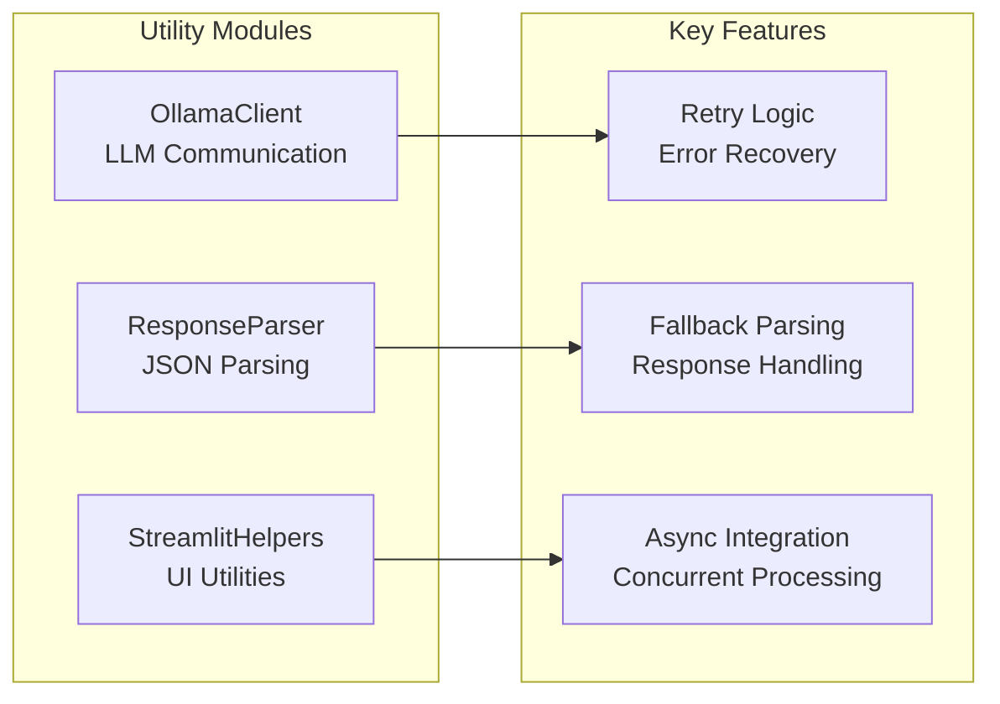
```mermaid
graph LR
    subgraph "Utility Modules"
        OLLAMA[OllamaClient<br/>LLM Communication]
        PARSER[ResponseParser<br/>JSON Parsing]
        HELPERS[StreamlitHelpers<br/>UI Utilities]
    end
    
    subgraph "Key Features"
        RETRY[Retry Logic<br/>Error Recovery]
        FALLBACK[Fallback Parsing<br/>Response Handling]
        ASYNC[Async Integration<br/>Concurrent Processing]
    end
    
    OLLAMA --> RETRY
    PARSER --> FALLBACK
    HELPERS --> ASYNC
```

**Key Files:**
- `utils/ollama_client.py`: Async Ollama API client with error handling
- `utils/response_parser.py`: Robust JSON response parsing
- `utils/streamlit_helpers.py`: Web interface utilities

---

## Data Models

### Core Data Structures

#### Agent Response Format
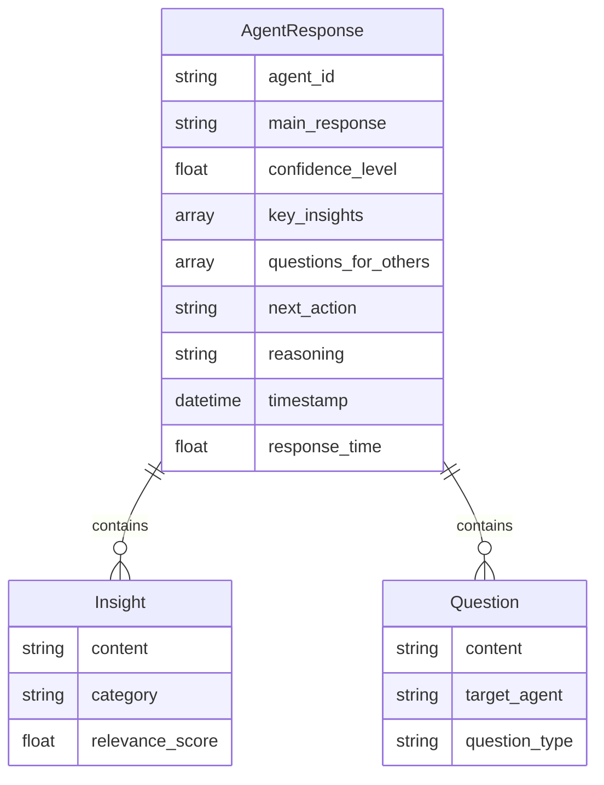
```mermaid
erDiagram
    AgentResponse {
        string agent_id
        string main_response
        float confidence_level
        array key_insights
        array questions_for_others
        string next_action
        string reasoning
        datetime timestamp
        float response_time
    }
    
    AgentResponse ||--o{ Insight : contains
    AgentResponse ||--o{ Question : contains
    
    Insight {
        string content
        string category
        float relevance_score
    }
    
    Question {
        string content
        string target_agent
        string question_type
    }
```

#### Configuration Schema
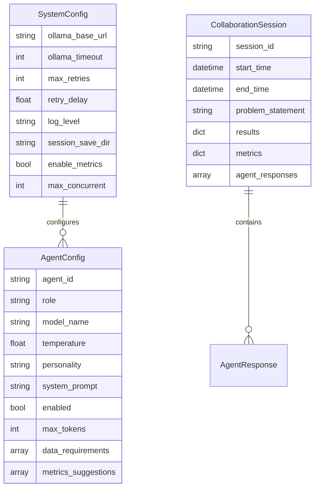
```mermaid
erDiagram
    SystemConfig {
        string ollama_base_url
        int ollama_timeout
        int max_retries
        float retry_delay
        string log_level
        string session_save_dir
        bool enable_metrics
        int max_concurrent
    }
    
    AgentConfig {
        string agent_id
        string role
        string model_name
        float temperature
        string personality
        string system_prompt
        bool enabled
        int max_tokens
        array data_requirements
        array metrics_suggestions
    }
    
    CollaborationSession {
        string session_id
        datetime start_time
        datetime end_time
        string problem_statement
        dict results
        dict metrics
        array agent_responses
    }
    
    SystemConfig ||--o{ AgentConfig : configures
    CollaborationSession ||--o{ AgentResponse : contains
```

#### Metrics Data Model
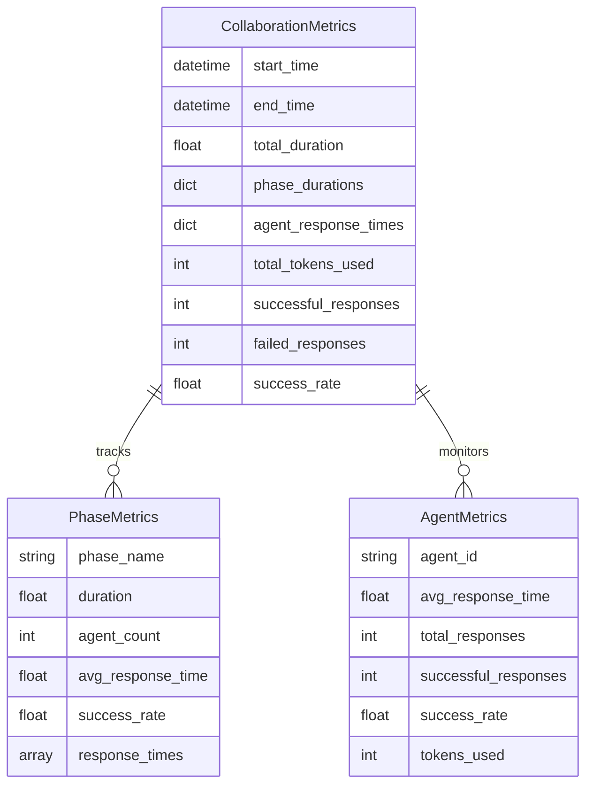
```mermaid
erDiagram
    CollaborationMetrics {
        datetime start_time
        datetime end_time
        float total_duration
        dict phase_durations
        dict agent_response_times
        int total_tokens_used
        int successful_responses
        int failed_responses
        float success_rate
    }
    
    PhaseMetrics {
        string phase_name
        float duration
        int agent_count
        float avg_response_time
        float success_rate
        array response_times
    }
    
    AgentMetrics {
        string agent_id
        float avg_response_time
        int total_responses
        int successful_responses
        float success_rate
        int tokens_used
    }
    
    CollaborationMetrics ||--o{ PhaseMetrics : tracks
    CollaborationMetrics ||--o{ AgentMetrics : monitors
```

### File System Data Models

#### Session Storage Structure
```
sessions/
├── session_20250807_143022_abc123.json
├── collaboration.log
└── metrics/
    ├── daily_stats.json
    └── agent_performance.json
```

#### Configuration File Structure
```
config/
├── agent_config.yaml          # Main configuration
├── presets/
│   ├── light.yaml             # Lightweight preset
│   ├── balanced.yaml          # Balanced preset
│   └── premium.yaml           # High-performance preset
└── README.md                  # Configuration documentation
```

---

## Core Workflows

### 4-Phase Collaboration Workflow

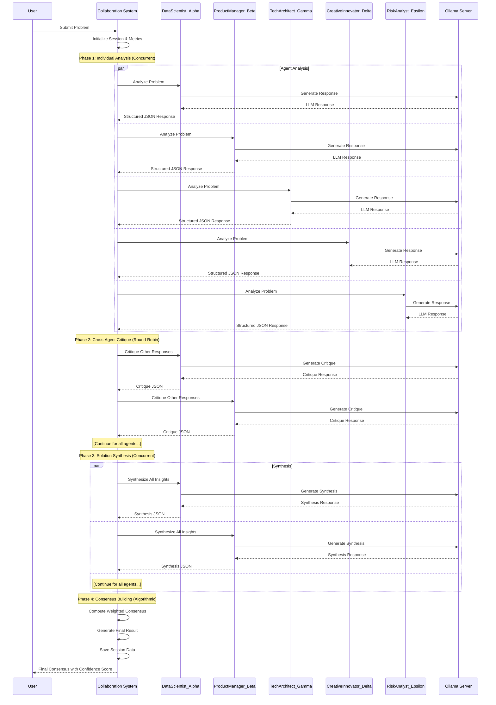
```mermaid
sequenceDiagram
    participant User
    participant System as Collaboration System
    participant Agent1 as DataScientist_Alpha
    participant Agent2 as ProductManager_Beta
    participant Agent3 as TechArchitect_Gamma
    participant Agent4 as CreativeInnovator_Delta
    participant Agent5 as RiskAnalyst_Epsilon
    participant Ollama as Ollama Server
    
    User->>System: Submit Problem
    System->>System: Initialize Session & Metrics
    
    Note over System: Phase 1: Individual Analysis (Concurrent)
    par Agent Analysis
        System->>Agent1: Analyze Problem
        Agent1->>Ollama: Generate Response
        Ollama-->>Agent1: LLM Response
        Agent1-->>System: Structured JSON Response
    and
        System->>Agent2: Analyze Problem
        Agent2->>Ollama: Generate Response
        Ollama-->>Agent2: LLM Response
        Agent2-->>System: Structured JSON Response
    and
        System->>Agent3: Analyze Problem
        Agent3->>Ollama: Generate Response
        Ollama-->>Agent3: LLM Response
        Agent3-->>System: Structured JSON Response
    and
        System->>Agent4: Analyze Problem
        Agent4->>Ollama: Generate Response
        Ollama-->>Agent4: LLM Response
        Agent4-->>System: Structured JSON Response
    and
        System->>Agent5: Analyze Problem
        Agent5->>Ollama: Generate Response
        Ollama-->>Agent5: LLM Response
        Agent5-->>System: Structured JSON Response
    end
    
    Note over System: Phase 2: Cross-Agent Critique (Round-Robin)
    System->>Agent1: Critique Other Responses
    Agent1->>Ollama: Generate Critique
    Ollama-->>Agent1: Critique Response
    Agent1-->>System: Critique JSON
    
    System->>Agent2: Critique Other Responses
    Agent2->>Ollama: Generate Critique
    Ollama-->>Agent2: Critique Response
    Agent2-->>System: Critique JSON
    
    Note over System: [Continue for all agents...]
    
    Note over System: Phase 3: Solution Synthesis (Concurrent)
    par Synthesis
        System->>Agent1: Synthesize All Insights
        Agent1->>Ollama: Generate Synthesis
        Ollama-->>Agent1: Synthesis Response
        Agent1-->>System: Synthesis JSON
    and
        System->>Agent2: Synthesize All Insights
        Agent2->>Ollama: Generate Synthesis
        Ollama-->>Agent2: Synthesis Response
        Agent2-->>System: Synthesis JSON
    and
        Note over System: [Continue for all agents...]
    end
    
    Note over System: Phase 4: Consensus Building (Algorithmic)
    System->>System: Compute Weighted Consensus
    System->>System: Generate Final Result
    System->>System: Save Session Data
    
    System-->>User: Final Consensus with Confidence Score
```

### Agent Initialization Workflow

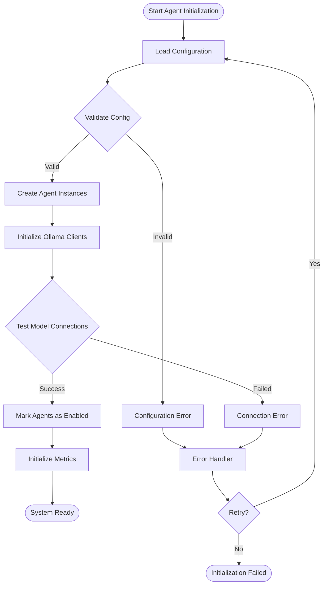
```mermaid
flowchart TD
    START([Start Agent Initialization]) --> LOAD_CONFIG[Load Configuration]
    LOAD_CONFIG --> VALIDATE_CONFIG{Validate Config}
    VALIDATE_CONFIG -->|Invalid| CONFIG_ERROR[Configuration Error]
    VALIDATE_CONFIG -->|Valid| CREATE_AGENTS[Create Agent Instances]
    
    CREATE_AGENTS --> INIT_OLLAMA[Initialize Ollama Clients]
    INIT_OLLAMA --> TEST_CONNECTIONS{Test Model Connections}
    TEST_CONNECTIONS -->|Failed| CONNECTION_ERROR[Connection Error]
    TEST_CONNECTIONS -->|Success| SET_ENABLED[Mark Agents as Enabled]
    
    SET_ENABLED --> INIT_METRICS[Initialize Metrics]
    INIT_METRICS --> READY([System Ready])
    
    CONFIG_ERROR --> ERROR_HANDLER[Error Handler]
    CONNECTION_ERROR --> ERROR_HANDLER
    ERROR_HANDLER --> RETRY{Retry?}
    RETRY -->|Yes| LOAD_CONFIG
    RETRY -->|No| FAILED([Initialization Failed])
```

### Response Processing Workflow

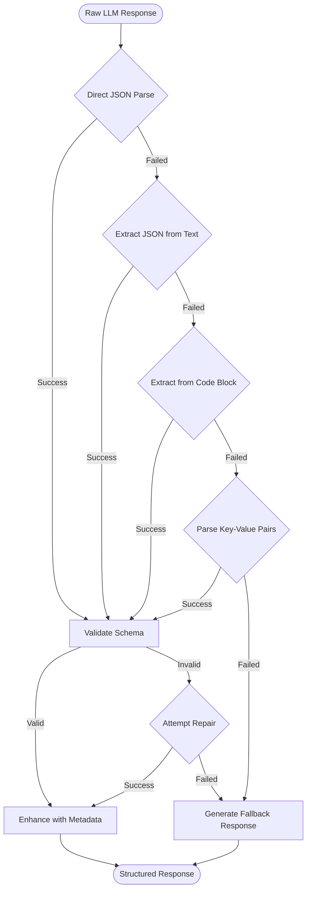
```mermaid
flowchart TD
    START([Raw LLM Response]) --> STRATEGY1{Direct JSON Parse}
    STRATEGY1 -->|Success| VALIDATE[Validate Schema]
    STRATEGY1 -->|Failed| STRATEGY2{Extract JSON from Text}
    
    STRATEGY2 -->|Success| VALIDATE
    STRATEGY2 -->|Failed| STRATEGY3{Extract from Code Block}
    
    STRATEGY3 -->|Success| VALIDATE
    STRATEGY3 -->|Failed| STRATEGY4{Parse Key-Value Pairs}
    
    STRATEGY4 -->|Success| VALIDATE
    STRATEGY4 -->|Failed| FALLBACK[Generate Fallback Response]
    
    VALIDATE -->|Valid| ENHANCE[Enhance with Metadata]
    VALIDATE -->|Invalid| REPAIR{Attempt Repair}
    
    REPAIR -->|Success| ENHANCE
    REPAIR -->|Failed| FALLBACK
    
    ENHANCE --> SUCCESS([Structured Response])
    FALLBACK --> SUCCESS
```

### Session Management Workflow

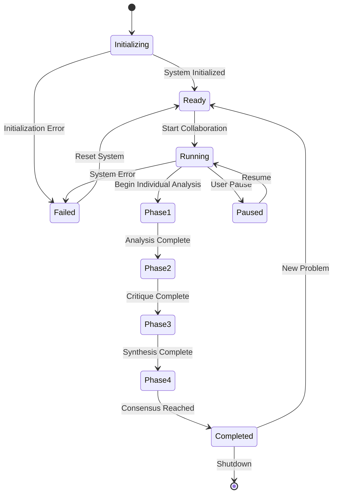
```mermaid
stateDiagram-v2
    [*] --> Initializing
    Initializing --> Ready : System Initialized
    Initializing --> Failed : Initialization Error
    
    Ready --> Running : Start Collaboration
    Running --> Phase1 : Begin Individual Analysis
    Phase1 --> Phase2 : Analysis Complete
    Phase2 --> Phase3 : Critique Complete
    Phase3 --> Phase4 : Synthesis Complete
    Phase4 --> Completed : Consensus Reached
    
    Running --> Paused : User Pause
    Paused --> Running : Resume
    
    Running --> Failed : System Error
    Failed --> Ready : Reset System
    
    Completed --> Ready : New Problem
    Completed --> [*] : Shutdown
```

---

## Technology Stack

### Backend Technologies

#### Core Runtime
- **Python 3.8+**: Primary programming language
- **asyncio**: Asynchronous programming framework
- **aiohttp**: Async HTTP client for Ollama communication
- **PyYAML**: Configuration file parsing
- **pathlib**: Modern file path handling

#### AI/ML Infrastructure
- **Ollama**: Local LLM inference engine
- **Multiple LLM Models**:
  - `llama3.2:3b`: Lightweight model for multiple agents
  - `deepseek-r1:latest`: Specialized technical analysis model
  - Configurable model assignment per agent

#### Data Processing
- **json/orjson**: High-performance JSON processing
- **re (regex)**: Text pattern matching and extraction
- **pandas**: Data manipulation and analysis
- **numpy**: Numerical computing (via pandas)

#### Monitoring & Logging
- **logging**: Built-in Python logging framework
- **time**: Performance timing and metrics
- **psutil**: System resource monitoring
- **colorama**: Cross-platform colored terminal output
- **rich**: Enhanced terminal formatting

### Frontend Technologies

#### Web Interface
- **Streamlit 1.46+**: Modern web application framework
- **Plotly**: Interactive data visualization
  - **plotly.express**: High-level plotting interface
  - **plotly.graph_objects**: Advanced chart customization
- **pandas**: Data manipulation for visualizations

#### Development Tools
- **watchdog**: File system monitoring for development
- **asyncio-throttle**: Rate limiting for API calls

### Development & Testing

#### Testing Framework
- **pytest**: Primary testing framework
- **pytest-asyncio**: Async test support
- **unittest.mock**: Mocking for isolated testing

#### Code Quality
- **Type Hints**: Full typing support with `typing` module
- **Dataclasses**: Structured data definitions
- **Enum**: Type-safe enumeration support

### Infrastructure & Deployment

#### Local Infrastructure
- **Ollama Server**: Local LLM inference
- **File System**: Session and configuration storage
- **Local Network**: HTTP communication between components

#### Configuration Management
- **YAML**: Human-readable configuration format
- **Environment Variables**: Runtime configuration override
- **Preset System**: Pre-configured deployment profiles

#### Process Management
- **Windows Batch Scripts**: Windows deployment automation
- **Bash Scripts**: Cross-platform startup scripts
- **Python Scripts**: System initialization and health checks

---

## Integration Points

### External Systems Integration

#### Ollama Server Integration
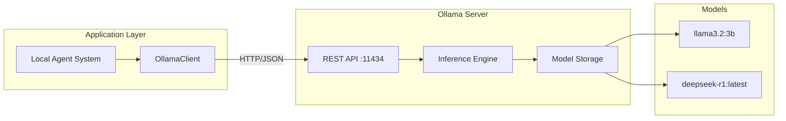
```mermaid
graph LR
    subgraph "Application Layer"
        APP[Local Agent System]
        CLIENT[OllamaClient]
    end
    
    subgraph "Ollama Server"
        API[REST API :11434]
        ENGINE[Inference Engine]
        MODELS[Model Storage]
    end
    
    subgraph "Models"
        LLAMA[llama3.2:3b]
        DEEPSEEK[deepseek-r1:latest]
    end
    
    APP --> CLIENT
    CLIENT -->|HTTP/JSON| API
    API --> ENGINE
    ENGINE --> MODELS
    MODELS --> LLAMA
    MODELS --> DEEPSEEK
```

**Integration Characteristics:**
- **Protocol**: HTTP REST API
- **Data Format**: JSON request/response
- **Endpoint**: `http://localhost:11434`
- **Authentication**: None (local)
- **Rate Limiting**: Configured via `asyncio-throttle`

#### File System Integration
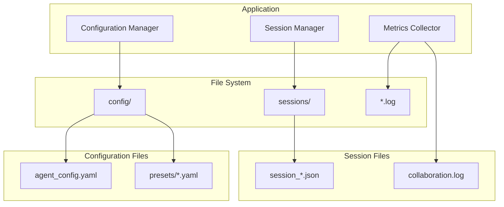
```mermaid
graph TB
    subgraph "Application"
        CONFIG_MGR[Configuration Manager]
        SESSION_MGR[Session Manager]
        METRICS[Metrics Collector]
    end
    
    subgraph "File System"
        CONFIG_DIR[config/]
        SESSION_DIR[sessions/]
        LOG_FILES[*.log]
    end
    
    subgraph "Configuration Files"
        MAIN_CONFIG[agent_config.yaml]
        PRESETS[presets/*.yaml]
    end
    
    subgraph "Session Files"
        SESSION_JSON[session_*.json]
        COLLAB_LOG[collaboration.log]
    end
    
    CONFIG_MGR --> CONFIG_DIR
    CONFIG_DIR --> MAIN_CONFIG
    CONFIG_DIR --> PRESETS
    
    SESSION_MGR --> SESSION_DIR
    SESSION_DIR --> SESSION_JSON
    
    METRICS --> LOG_FILES
    METRICS --> COLLAB_LOG
```

### Internal Component Integration

#### Agent-to-System Communication
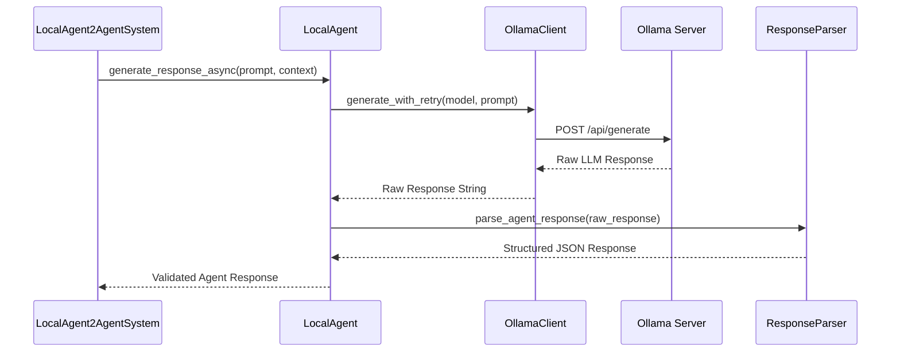
```mermaid
sequenceDiagram
    participant System as LocalAgent2AgentSystem
    participant Agent as LocalAgent
    participant Client as OllamaClient
    participant Ollama as Ollama Server
    participant Parser as ResponseParser
    
    System->>Agent: generate_response_async(prompt, context)
    Agent->>Client: generate_with_retry(model, prompt)
    Client->>Ollama: POST /api/generate
    Ollama-->>Client: Raw LLM Response
    Client-->>Agent: Raw Response String
    Agent->>Parser: parse_agent_response(raw_response)
    Parser-->>Agent: Structured JSON Response
    Agent-->>System: Validated Agent Response
```

#### Configuration System Integration
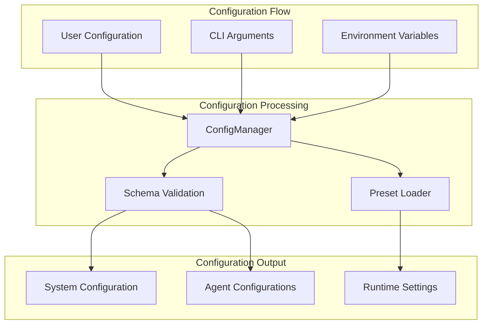
```mermaid
graph TD
    subgraph "Configuration Flow"
        USER_INPUT[User Configuration]
        CLI_ARGS[CLI Arguments]
        ENV_VARS[Environment Variables]
    end
    
    subgraph "Configuration Processing"
        CONFIG_MGR[ConfigManager]
        SCHEMA_VAL[Schema Validation]
        PRESET_LOADER[Preset Loader]
    end
    
    subgraph "Configuration Output"
        SYSTEM_CONFIG[System Configuration]
        AGENT_CONFIGS[Agent Configurations]
        RUNTIME_SETTINGS[Runtime Settings]
    end
    
    USER_INPUT --> CONFIG_MGR
    CLI_ARGS --> CONFIG_MGR
    ENV_VARS --> CONFIG_MGR
    
    CONFIG_MGR --> SCHEMA_VAL
    CONFIG_MGR --> PRESET_LOADER
    
    SCHEMA_VAL --> SYSTEM_CONFIG
    SCHEMA_VAL --> AGENT_CONFIGS
    PRESET_LOADER --> RUNTIME_SETTINGS
```

### API Interfaces

#### CLI Interface
```bash
# Core Commands
python main.py --test                           # System health check
python main.py --problem "Your problem here"    # Single problem solving
python main.py --interactive                    # Interactive mode
python main.py --examples                       # Demo scenarios

# Configuration Options
python main.py --preset [light|balanced|premium]
python main.py --config custom_config.yaml
python main.py --verbose                        # Debug logging

# Information Commands
python main.py --list-presets                   # Available presets
python main.py --config-info                    # Current configuration
```

#### Web Interface Endpoints
```python
# Streamlit Internal Routing
/                           # Main dashboard
/?page=history             # Session history
/?page=settings            # Configuration
/?page=about               # Documentation

# Internal API Functions
start_collaboration(problem: str) -> Dict
get_system_status() -> Dict
export_session(session_id: str) -> bytes
update_configuration(config: Dict) -> bool
```

---

## Security & Performance

### Security Considerations

#### Local-First Security Model
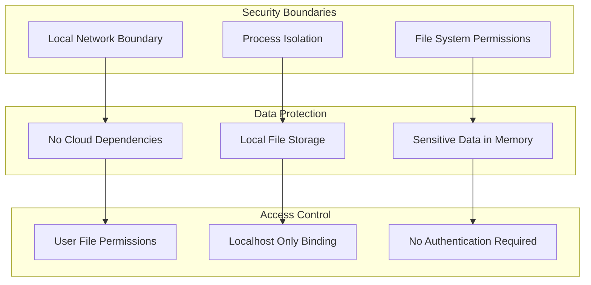
```mermaid
graph TB
    subgraph "Security Boundaries"
        LOCAL[Local Network Boundary]
        PROCESS[Process Isolation]
        FILE[File System Permissions]
    end
    
    subgraph "Data Protection"
        NO_CLOUD[No Cloud Dependencies]
        LOCAL_STORAGE[Local File Storage]
        MEMORY_ONLY[Sensitive Data in Memory]
    end
    
    subgraph "Access Control"
        USER_PERMS[User File Permissions]
        LOCALHOST[Localhost Only Binding]
        NO_AUTH[No Authentication Required]
    end
    
    LOCAL --> NO_CLOUD
    PROCESS --> LOCAL_STORAGE
    FILE --> MEMORY_ONLY
    
    NO_CLOUD --> USER_PERMS
    LOCAL_STORAGE --> LOCALHOST
    MEMORY_ONLY --> NO_AUTH
```

**Security Features:**
- **No External Dependencies**: Complete local operation
- **No Data Transmission**: All processing happens locally
- **File System Security**: Relies on OS-level file permissions
- **Process Isolation**: Standard OS process security
- **No Authentication**: Assumes trusted local environment

#### Potential Security Enhancements
- **Configuration Encryption**: Encrypt sensitive configuration files
- **Session Encryption**: Encrypt stored session data
- **Access Logging**: Log all system access and operations
- **User Authentication**: Add authentication for web interface
- **HTTPS**: Enable HTTPS for web interface

### Performance Characteristics

#### Concurrent Processing Architecture
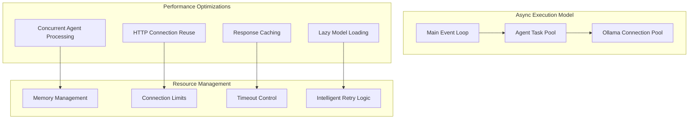
```mermaid
graph TD
    subgraph "Async Execution Model"
        MAIN[Main Event Loop]
        AGENT_POOL[Agent Task Pool]
        OLLAMA_POOL[Ollama Connection Pool]
    end
    
    subgraph "Performance Optimizations"
        CONCURRENT[Concurrent Agent Processing]
        CONNECTION_REUSE[HTTP Connection Reuse]
        RESPONSE_CACHING[Response Caching]
        LAZY_LOADING[Lazy Model Loading]
    end
    
    subgraph "Resource Management"
        MEMORY_MGT[Memory Management]
        CONNECTION_LIMITS[Connection Limits]
        TIMEOUT_CONTROL[Timeout Control]
        RETRY_LOGIC[Intelligent Retry Logic]
    end
    
    MAIN --> AGENT_POOL
    AGENT_POOL --> OLLAMA_POOL
    
    CONCURRENT --> MEMORY_MGT
    CONNECTION_REUSE --> CONNECTION_LIMITS
    RESPONSE_CACHING --> TIMEOUT_CONTROL
    LAZY_LOADING --> RETRY_LOGIC
```

#### Performance Metrics

**Typical Performance Characteristics:**
- **Phase 1 (Individual Analysis)**: 10-30 seconds (concurrent)
- **Phase 2 (Cross-Agent Critique)**: 15-45 seconds (sequential)
- **Phase 3 (Solution Synthesis)**: 10-30 seconds (concurrent)
- **Phase 4 (Consensus Building)**: <1 second (algorithmic)
- **Total Session Time**: 35-106 seconds

**Resource Utilization:**
- **CPU**: High during inference, low during I/O
- **Memory**: ~100-500MB base, +model memory per agent
- **Network**: Local HTTP only, minimal bandwidth
- **Storage**: Session files ~10-100KB each

**Scalability Factors:**
- **Agent Count**: Linear scaling with diminishing returns
- **Model Size**: Exponential impact on memory and processing time
- **Problem Complexity**: Linear impact on response length and processing
- **Concurrent Sessions**: Limited by Ollama server capacity

#### Performance Monitoring
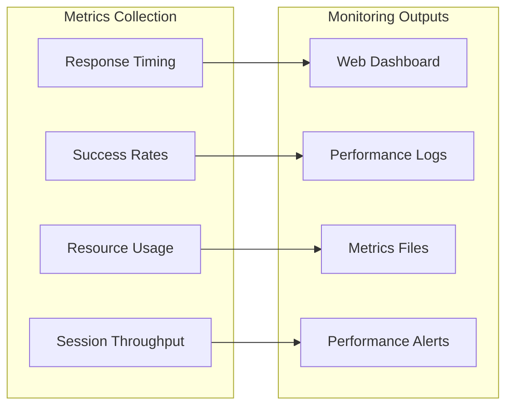
```mermaid
graph LR
    subgraph "Metrics Collection"
        TIMING[Response Timing]
        SUCCESS[Success Rates]
        RESOURCE[Resource Usage]
        THROUGHPUT[Session Throughput]
    end
    
    subgraph "Monitoring Outputs"
        DASHBOARD[Web Dashboard]
        LOGS[Performance Logs]
        METRICS_FILE[Metrics Files]
        ALERTS[Performance Alerts]
    end
    
    TIMING --> DASHBOARD
    SUCCESS --> LOGS
    RESOURCE --> METRICS_FILE
    THROUGHPUT --> ALERTS
```

---

## Deployment Architecture

### Local Development Deployment

```mermaid
graph TB
    subgraph "Development Environment"
        DEV_MACHINE[Developer Machine]
        PYTHON_ENV[Python Environment]
        OLLAMA_DEV[Ollama Development]
    end
    
    subgraph "Development Tools"
        IDE[VS Code/PyCharm]
        DEBUGGER[Python Debugger]
        HOT_RELOAD[Auto-Reload]
    end
    
    subgraph "Local Services"
        OLLAMA_SERVER[Ollama Server :11434]
        STREAMLIT_DEV[Streamlit Dev Server :8501]
        FILE_SYSTEM[Local File System]
    end
    
    DEV_MACHINE --> PYTHON_ENV
    PYTHON_ENV --> OLLAMA_DEV
    
    IDE --> DEBUGGER
    DEBUGGER --> HOT_RELOAD
    
    OLLAMA_DEV --> OLLAMA_SERVER
    HOT_RELOAD --> STREAMLIT_DEV
    STREAMLIT_DEV --> FILE_SYSTEM
```

### Production Deployment

```mermaid
graph TB
    subgraph "Production Server"
        PROD_SERVER[Production Server]
        PYTHON_PROD[Python Production Environment]
        OLLAMA_PROD[Ollama Production]
    end
    
    subgraph "Production Services"
        OLLAMA_SERVICE[Ollama Service :11434]
        STREAMLIT_PROD[Streamlit Production :8501]
        FILE_STORAGE[Production File Storage]
        LOG_SYSTEM[Centralized Logging]
    end
    
    subgraph "Management Tools"
        PROCESS_MGT[Process Management]
        MONITORING[System Monitoring]
        BACKUP[Data Backup]
    end
    
    PROD_SERVER --> PYTHON_PROD
    PYTHON_PROD --> OLLAMA_PROD
    
    OLLAMA_PROD --> OLLAMA_SERVICE
    OLLAMA_SERVICE --> STREAMLIT_PROD
    STREAMLIT_PROD --> FILE_STORAGE
    FILE_STORAGE --> LOG_SYSTEM
    
    PROCESS_MGT --> MONITORING
    MONITORING --> BACKUP
```

### Container Deployment (Future)

```mermaid
graph TB
    subgraph "Container Architecture"
        DOCKER_HOST[Docker Host]
        CONTAINER_NET[Container Network]
    end
    
    subgraph "Application Containers"
        APP_CONTAINER[App Container]
        OLLAMA_CONTAINER[Ollama Container]
        WEB_CONTAINER[Web Container]
    end
    
    subgraph "Persistent Storage"
        CONFIG_VOLUME[Configuration Volume]
        SESSION_VOLUME[Session Volume]
        MODEL_VOLUME[Model Volume]
    end
    
    DOCKER_HOST --> CONTAINER_NET
    CONTAINER_NET --> APP_CONTAINER
    CONTAINER_NET --> OLLAMA_CONTAINER
    CONTAINER_NET --> WEB_CONTAINER
    
    APP_CONTAINER --> CONFIG_VOLUME
    APP_CONTAINER --> SESSION_VOLUME
    OLLAMA_CONTAINER --> MODEL_VOLUME
```

### Deployment Options

#### 1. **Standalone Installation**
```bash
# Clone repository
git clone https://github.com/JacobKayembekazadi/adk-experiment-22

# Install dependencies
pip install -r requirements.txt

# Install Ollama and models
ollama pull llama3.2:3b
ollama pull deepseek-r1:latest

# Start system
python main.py --test
python run_streamlit.py
```

#### 2. **Automated Setup**
```bash
# Windows
start_app.bat

# Cross-platform
python install.py
python run_streamlit.py
```

#### 3. **Configuration Management**
```yaml
# Production configuration example
system:
  ollama_base_url: "http://ollama-server:11434"
  max_concurrent: 10
  log_level: "INFO"
  
agents:
  - agent_id: "DataScientist_Alpha"
    model_name: "llama3.2:3b"
    enabled: true
    temperature: 0.3
```

### Monitoring & Maintenance

#### Health Checks
```python
# System health verification
async def health_check():
    # Test Ollama connectivity
    # Verify model availability
    # Check file system permissions
    # Validate configuration
    # Test agent initialization
```

#### Maintenance Tasks
- **Model Updates**: Regular model version updates
- **Session Cleanup**: Automated old session removal
- **Log Rotation**: Automated log file management
- **Configuration Backup**: Regular configuration snapshots
- **Performance Monitoring**: Continuous metrics collection

---

## Conclusion

The Local Multi-Agent Collaborative Intelligence System represents a sophisticated yet practical approach to leveraging multiple AI agents for complex problem solving. The architecture prioritizes local operation, data privacy, and production reliability while maintaining flexibility and extensibility.

### Key Architectural Strengths

1. **Local-First Design**: Complete data sovereignty and no external dependencies
2. **Modular Architecture**: Clear separation of concerns and extensible design
3. **Robust Error Handling**: Multiple fallback strategies and graceful degradation
4. **Performance Optimization**: Concurrent processing and efficient resource utilization
5. **Dual Interface**: Both programmatic (CLI) and user-friendly (Web) interfaces
6. **Production Ready**: Comprehensive logging, metrics, and session management

### Future Enhancement Opportunities

1. **Distributed Deployment**: Multi-node agent distribution
2. **Custom Model Integration**: Support for additional LLM models
3. **Enhanced Web Interface**: Real-time collaboration visualization
4. **API Server**: RESTful API for external integration
5. **Advanced Analytics**: ML-based performance optimization
6. **Plugin Architecture**: Extensible agent and processing plugins

This architecture provides a solid foundation for scaling from individual use to enterprise deployment while maintaining the core benefits of local operation and data privacy.

---

*Document Version 1.0.0 - Generated on August 7, 2025*
